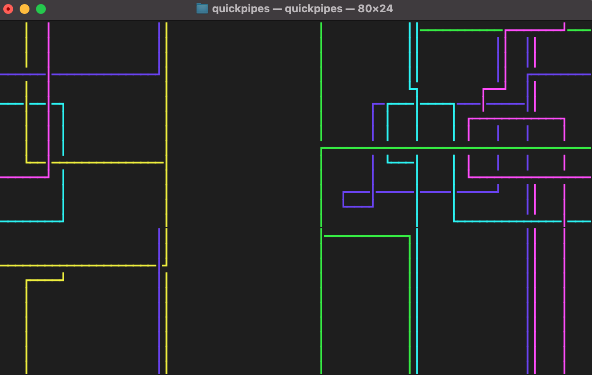
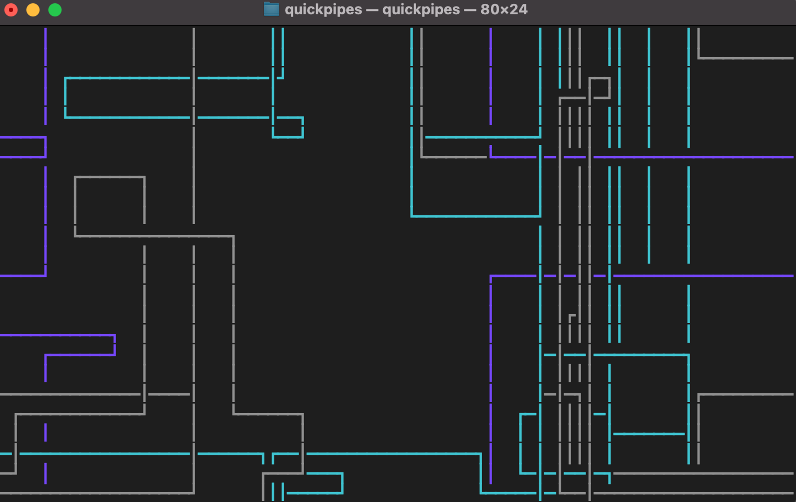

# Quickpipes
a minimal terminal screensaver
<div>
    
    
</div>
obviously inspired by pipes.sh

## Installation
first, make sure cargo is installed
```
cargo --version
```

navigate to your intended directory and install
```
cargo install --git https://github.com/arael34/quickpipes
```

you should now be able to run it.
```
quickpipes
```
